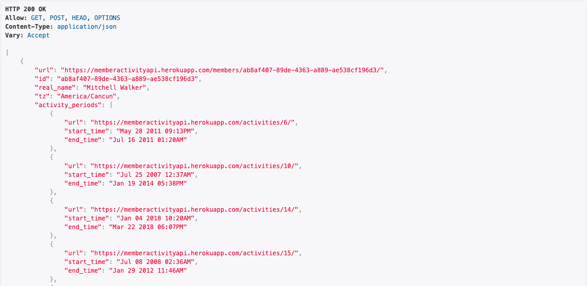

# https://memberactivityapi.herokuapp.com/

Designed and Implemented a Django REST application with User and Activity models.

User-Activity API end-points with some dummy data generated using custom management commands.

#### Custom Management Commands:
 ```
 python manage.py createtimezones
 python manage.py createactivity <number of activity(int)>
 python manage.py createusers <number of user(int)>
 ```
 
#### List of API end-points:

  Allowed Operations: GET, POST, HEAD, OPTIONS
- List of all **members**: https://memberactivityapi.herokuapp.com/members/
  
  
  
- List of all **activities**: https://memberactivityapi.herokuapp.com/activities/
- List of all **timezones**: https://memberactivityapi.herokuapp.com/timezones/

- Access specific **member**: https://memberactivityapi.herokuapp.com/members/<uuid\>/
  
  Allowed Operations: GET, POST, HEAD, OPTIONS
  
  ex- https://memberactivityapi.herokuapp.com/members/ab8af407-89de-4363-a889-ae538cf196d3/
- Access specific **timezone**: https://memberactivityapi.herokuapp.com/timezones/<id\>/
  
  Allowed Operations: GET, PUT, PATCH, DELETE, HEAD, OPTIONS
  
  ex- https://memberactivityapi.herokuapp.com/timezones/1/
- Access specific **activity**: https://memberactivityapi.herokuapp.com/activities/<id\>/
  
  Allowed Operations: GET, PUT, PATCH, DELETE, HEAD, OPTIONS
  
  ex- https://memberactivityapi.herokuapp.com/activities/1/

To access the API results in json format use -> <absoluteURL\>/?format=json

ex - https://memberactivityapi.herokuapp.com/members/?format=json
  
All instance can be refered using its attached URL. 
  
